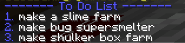

# ToDoList
A Simple todo list plugin for spigot based minecraft servers

I made this so that my friends and I could keep what projects we were working on in our SMP instead of having to keep a pinned message on discord up to date.

## Features
- List out the items on your list
  
- Information about who and when each item was created
  
- Easily add items with a simple command
  
- Easily remove items by clicking on them

### Commands
`/todolist list` - See all the items on your todolist

`/todolist add` - add an item to your todolist

### Permissions
`todolist.see` - See the to do list

`todolist.edit` - Add & delete items on the to do list

## Download
https://www.spigotmc.org/resources/to-do-list.94596/
